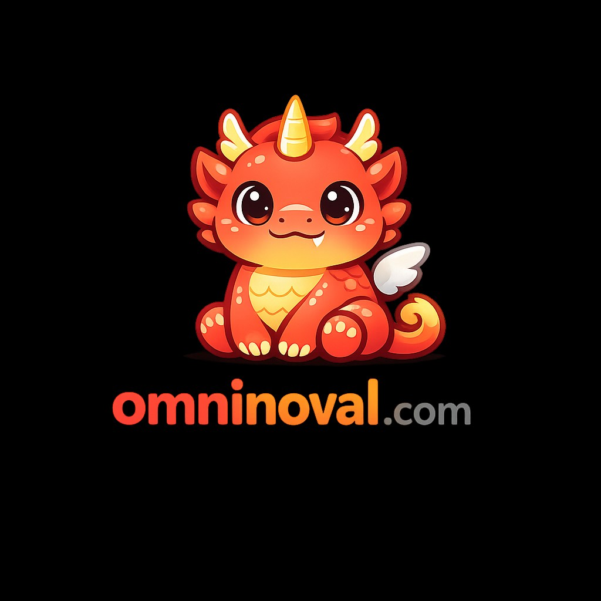

# OmniNova Claw

<div align="center">
  
  <p><strong>下一代 AI Agent 平台与桌面控制中心</strong></p>
  <p>
    <a href="README.md">English Docs</a> | 
    <a href="#特性">特性</a> | 
    <a href="#快速开始">快速开始</a> | 
    <a href="#架构">架构</a>
  </p>
</div>

---

**OmniNova Claw** 是一个功能强大的、本地优先的 AI Agent 平台，基于 **Novalclaw** 架构构建。它结合了高性能的 Rust 核心运行时与现代化的 Tauri + React 桌面界面，让您能够完全掌控您的 AI Agent、技能 (Skills) 和模型供应商。

无论您是构建复杂的 Agent 工作流，管理多个 LLM 供应商（OpenAI、Anthropic、Gemini、DeepSeek 等），还是在各种渠道（Slack、Discord、微信等）部署机器人，OmniNova Claw 都能为您提供一个统一、安全且可扩展的基础。

## ✨ 特性

### 👻 灵魂系统 (Soul System & MBTI)
**灵魂系统** 赋予您的 Agent 独特的身份和行为框架，深度结合 **MBTI** 心理学模型。
- **MBTI 人格构建**: 利用 MBTI 类型（如 **INTJ** 战略家、**ENFP** 竞选者）来定义 Agent 的认知模式。系统将这些类型转化为独特的推理逻辑和沟通风格，使 Agent 更具“人性”。
- **系统提示词 (System Prompt)**: 定义 Agent 的核心人格、语气和行为约束。
- **行为控制**: 微调交互风格、上下文处理方式（如 `compact_context` 压缩上下文）以及工具使用限制。
- **自适应人设**: 根据任务或渠道的不同，在不同的“灵魂”（如程序员、研究员、助手）之间灵活切换。

### 🧠 三层记忆系统 (Three-Layer Memory System)
OmniNova Claw 实现了精密的三层认知记忆架构：
1.  **工作记忆 (Working Memory - 短期)**: 管理当前的对话上下文，通过智能 Token 压缩和滑动窗口机制，确保 Agent 专注于当下的任务。
2.  **情景记忆 (Episodic Memory - 长期)**: 存储和检索过去的交互历史，保留会话的血缘关系 (Lineage)，使 Agent 能够回忆起之前的上下文。
3.  **语义/技能记忆 (Semantic/Skill Memory - 知识)**: 基于加载的技能 (`SKILL.md`) 和外部文档构建的持久化知识库，允许 Agent 运用特定领域的专业知识。

### 🛠️ 强大的工具与能力
- **内置工具**: 文件操作、Web 搜索、PDF 阅读、Git 操作、Shell 执行（沙箱环境）。
- **技能系统 (Skills System)**: 可扩展的能力系统，兼容 OpenClaw 技能格式。支持从 `SKILL.md` 或本地目录加载技能。
- **ACP 协议**: 实现了 Agent Control Protocol，用于标准化的 Agent-工具交互。
- **安全第一**: 内置 E-stop (紧急停止) 机制、工具策略强制执行以及危险命令过滤。

### 🔌 通用连接性
- **多模型支持**: 无缝切换 OpenAI, Anthropic, Gemini, DeepSeek, Qwen, Ollama 等多种模型。
- **全渠道接入**: 将 Agent 连接到 Slack, Discord, Telegram, 微信, 飞书, Lark, 钉钉, WhatsApp, Email 和 Webhook。
- **声明式路由**: 基于渠道、用户或元数据将消息路由到特定的 Agent，无需编写代码。

### 🖥️ 现代桌面体验
- **跨平台**: 提供 **macOS** (Apple Silicon/Intel), **Windows**, 和 **Linux** 的原生应用。
- **可视化配置**: 通过直观的 React UI 配置供应商、渠道和技能。
- **本地网关**: 在本地运行完整的技术栈，内置 HTTP 网关和守护进程管理。

## 🚀 快速开始

### 无桌面环境（Linux / Unix、SSH、服务器）

**不依赖** Tauri 桌面与 Node.js，也**无需**安装 `libwebkit2gtk` 等桌面库；仅需 **Rust 工具链**。在仓库根目录 `omninovalclaw/` 执行：

```bash
cargo build -p omninova-core --release --bin omninova
cp target/release/omninova ~/.local/bin/   # 或加入 PATH
omninova doctor
omninova setup          # 或 omninova configure
omninova gateway run    # 前台启动网关（Ctrl+C 结束）
```

**后台常驻（与 `omninova gateway` 等价）**：下列命令均使用**当前 `omninova` 可执行文件**注册服务，请先将其放到稳定路径（如 `~/.local/bin/omninova`）再执行 `daemon install`。

- **Linux**：**systemd 用户单元**（无需 root），单元文件在 `~/.config/systemd/user/omninova-gateway.service`，日志可用 `journalctl --user -u omninova-gateway.service`。

```bash
omninova daemon install
omninova daemon status
```

- **macOS**：**launchd 用户代理**，plist 在 `~/Library/LaunchAgents/com.omninova.gateway.plist`，标签为 `com.omninova.gateway`；标准输出/错误默认写入 `/tmp/omninova-gateway.out.log` 与 `/tmp/omninova-gateway.err.log`。

```bash
omninova daemon install
omninova daemon status
launchctl list com.omninova.gateway   # 可选：查看是否已加载
```

- **Windows**：`omninova daemon install` 会通过**任务计划程序**注册网关卡；详见 `omninova daemon check` 与 `omninova doctor`。

配置默认在 **`~/.omninova/config.toml`**，也可用环境变量 **`OMNINOVA_CONFIG_DIR`** 指定配置目录。其余子命令（`agent`、`skills`、`channels`、`cron` 等）与带桌面版相同。

### 前置要求
- **Rust**: 最新稳定版 (`rustup update`)
- **仅命令行 / 无桌面**：仅安装 Rust 即可；**不需要** Node.js。
- **构建桌面应用（Tauri）时另需**:
  - **Node.js**: 版本 22+ (`node -v`)
- **系统依赖**（仅构建或运行 **桌面应用** 时需要）:
  - **Linux**: `libwebkit2gtk-4.1-dev`, `libappindicator3-dev`, `librsvg2-dev`
  - **Windows**: Microsoft Visual Studio C++ Build Tools

### 安装步骤

1.  **克隆仓库**
    ```bash
    git clone https://github.com/omninova/claw.git
    cd claw/omninovalclaw
    ```

2.  **安装依赖**
    ```bash
    # 安装前端依赖
    cd apps/omninova-tauri
    npm install
    ```

3.  **开发模式运行**
    ```bash
    # 运行 Tauri 应用 (前端 + Rust 后端)
    npm run tauri dev
    ```

4.  **构建发布版本**
    ```bash
    # 为当前操作系统构建应用
    npm run tauri build
    ```
    构建产物将生成在 `apps/omninova-tauri/src-tauri/target/release/bundle/` 目录下。

### 桌面应用行为（常驻进程与 `omninova` 命令）

与 **Ollama** 类似：安装后应用**常驻后台**，关闭主窗口不会退出进程（退到**系统托盘**），网关仍在本机端口运行；从托盘选择「退出」才会结束进程。Dock/任务栏再次打开应用会恢复主窗口。

**命令行 `omninova`（全平台）**：若构建前已在工作区编译过 `omninova` 二进制，打包时会将其复制到 `src-tauri/resources/cli/` 并随安装包分发。在桌面应用 **通用设置** 中可使用 **「安装 / 更新 omninova 到 PATH」**：无需管理员权限，会将 CLI 复制到用户目录并写入 PATH——**macOS / Linux** 为 `~/.local/bin/`，**Windows** 为 `%LOCALAPPDATA%\omninova\bin\`（并更新用户级 PATH）。也可手动将该目录加入 PATH，或在 macOS/Linux 下软链到 `/usr/local/bin`（需管理员）。未随包带上时，仍可在仓库根目录执行 `cargo build -p omninova-core --bin omninova`，将 `target/release/omninova` 自行加入 PATH。

## 🏗️ 架构

OmniNova Claw 采用模块化的工作区结构：

```text
omninovalclaw/
├── skills/                  # 内置 SKILL.md 技能包（可导入工作区）
├── apps/
│   └── omninova-tauri/      # 桌面前端 (React 19 + TypeScript) & Tauri 配置
│       ├── src/             # UI 组件 (Setup, Chat, Console)
│       ├── src-tauri/       # Tauri 后端入口
│       └── public/          # 静态资源
├── crates/
│   └── omninova-core/       # 核心运行时库
│       ├── agent/           # Agent 逻辑 & 调度器
│       ├── skills/          # 技能系统实现
│       ├── tools/           # 原生工具 (PDF, Web, File 等)
│       ├── providers/       # LLM 供应商集成
│       ├── channels/        # IM & Webhook 适配器
│       └── gateway/         # HTTP API 网关
└── .github/workflows/       # CI/CD 流水线 (release.yml)
```

## ⚙️ 配置

OmniNova Claw 使用 `config.toml` 文件进行配置，可以通过桌面 UI 管理或手动编辑。

- **配置位置**: `~/.omninova/config.toml` (默认)
- **环境变量**: 可以覆盖配置设置 (例如 `OMNINOVA_OPENAI_API_KEY`)。

桌面应用提供了 **设置向导 (Setup Wizard)** 以便轻松配置：
- **供应商 (Providers)**: API Key 和 Base URL。
- **渠道 (Channels)**: 机器人 Token 和 Webhook 密钥。
- **技能 (Skills)**: 启用/禁用 Open Skills 并设置导入路径。仓库内置示例见 `skills/`（含 **金融分析** `financial-analysis`、**估值** `financial-valuation`、**量化研究** `quantitative-research`、**量化回测** `quantitative-backtest`、**渗透评估** `penetration-assessment`）；可在仓库根目录执行 `omninova skills import --from ./skills` 导入到默认技能目录。
- **人设 (Persona)**: 定义 Agent 的系统提示词和行为。

### 浏览器自动化（agent-browser）

启用 `[browser] enabled = true` 后，Agent 可通过 **agent-browser** 控制无头浏览器。若出现「找不到 CLI」或工具报错：

1. 安装 CLI 并下载 Chromium：`npm install -g agent-browser && agent-browser install`
2. 桌面端仓库内也可：`cd apps/omninova-tauri && npm run setup:browser`
3. 自定义二进制路径：设置环境变量 `OMNINOVA_AGENT_BROWSER_BIN` 为可执行文件绝对路径
4. 暂不需要浏览器时：在 `config.toml` 中设 `[browser] enabled = false`，避免模型尝试调用 `browser` 工具

命令行自检：`omninova doctor`（或网关返回的 `/api/doctor`）会提示依赖是否就绪。

## 📦 发布

我们使用 GitHub Actions 进行自动化的跨平台构建。
- **稳定版本**: 标记为 `v*` (例如 `v0.1.0`)。
- **平台支持**:
  - macOS (Universal/Apple Silicon) `.dmg`
  - Windows (x64) `.msi`
  - Linux (x64) `.AppImage` / `.deb`

## 📄 许可证

本项目基于 [MIT License](LICENSE) 授权。

---

<div align="center">
  <sub>Built with ❤️ by the OmniNova Team</sub>
</div>
